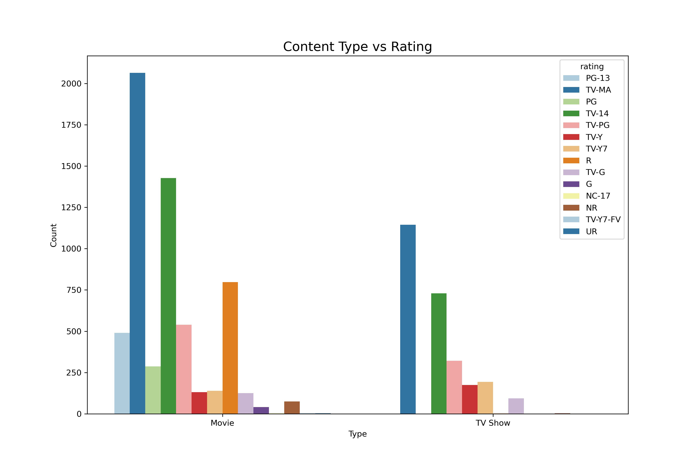
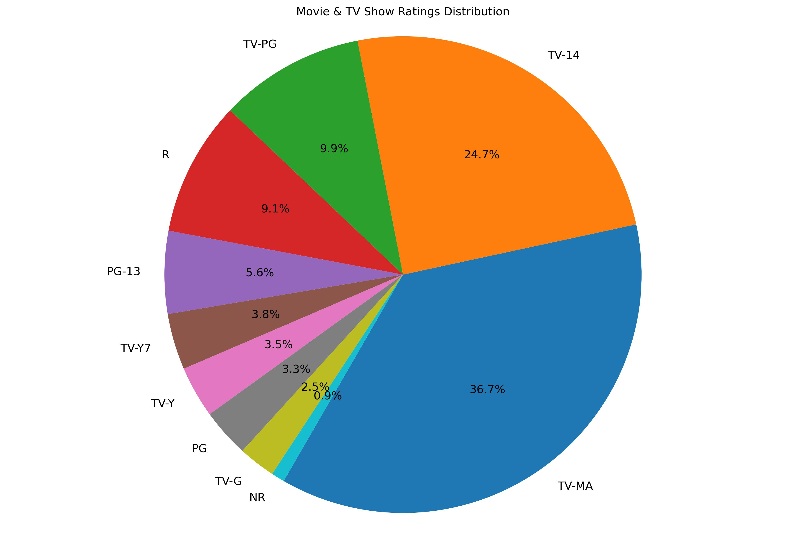

# 📊 Netflix Content Analysis with Python

## Project Objective

## 📁 Dataset

The dataset used is `netflix_data.csv`, containing details about Netflix content such as:
- Show_Id
- Type
- Title
- Director
- Cast
- Country
- Date added
- Release year
- Rating
- Duration
- Genres


## 📌 Key Features of the Analysis

- Importing and inspecting the dataset  
- Cleaning and handling missing values  
- Analyzing content types (Movies vs TV Shows)  
- Exploring genre distributions  
- Studying trends over release years  
- Top contributing directors and countries  
- Visualizations using Matplotlib and Seaborn


## 🛠️ Libraries Used

- pandas
- numpy
- matplotlib
- seaborn


## 📈 Visualizations

### ✅ Content Type vs Rating Count Plot


### ✅ Count Plot By Rating


### ✅ Ratings Distribution Pie Chart


### ✅ Top 10 Movie Genres


### ✅ Top 10 TV Show Genres


### ✅ Number of Movies Released by Year


### ✅ Top 5 Directors


## 📷 Visual Examples

The project includes visualizations like:

- Bar charts of top genres  
- Line plots of content over time  
- Pie charts showing distribution of content types  

## ▶️ How to Run

1. Clone the repository:
   ```bash
   git clone https://github.com/yourusername/netflix-content-analysis.git
   cd netflix-content-analysis
